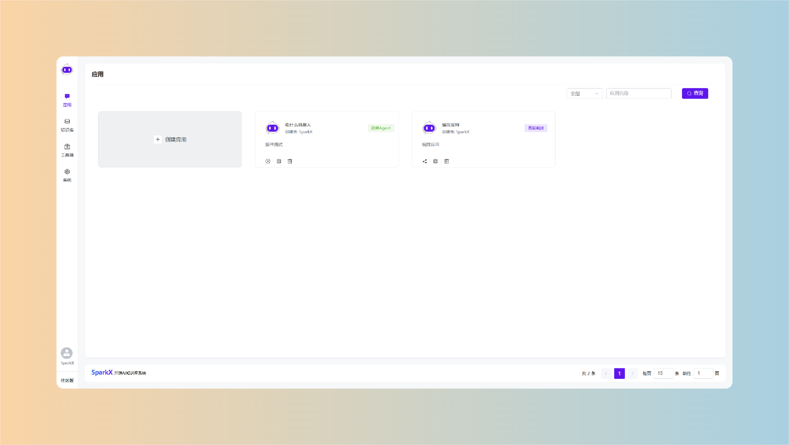
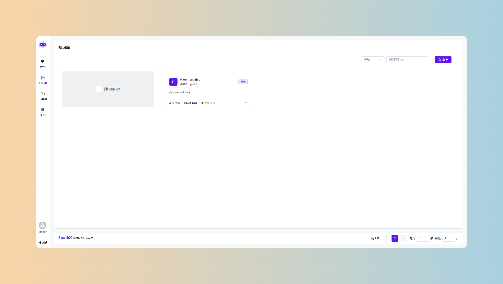
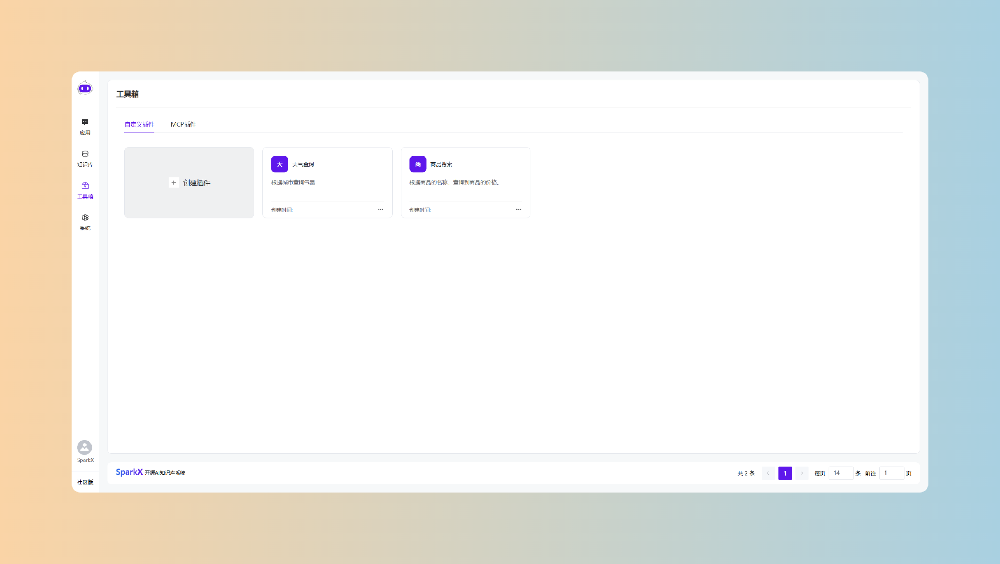
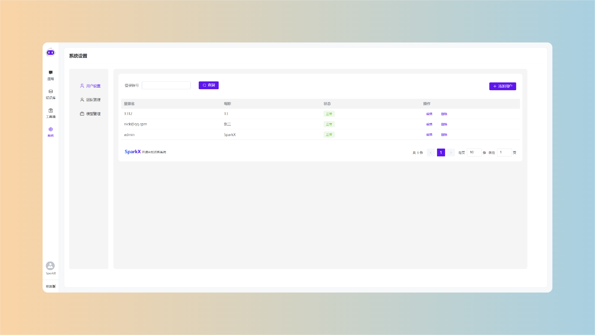
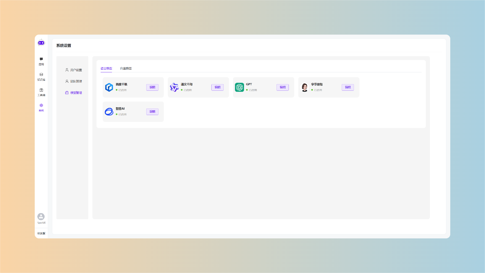
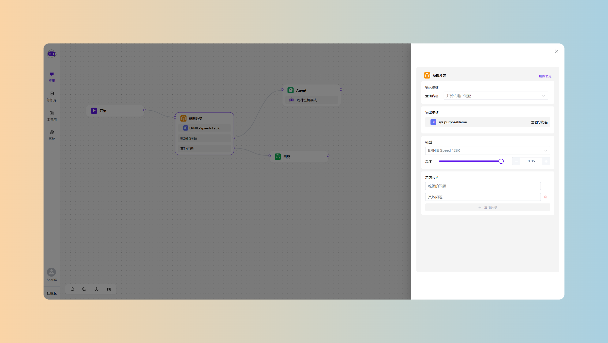
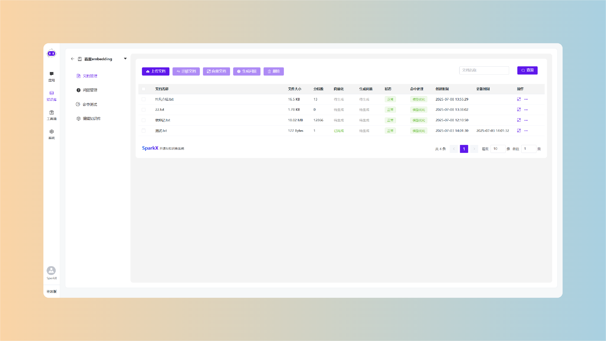

<p align="center">

</p>

🚀SparkX 是采用 Springboot3 + PgSQL + Vue3 开发的，采用大语言模型 和 RAG 的知识库问答系统。开箱即用、模型任选、灵活编排，支持快速嵌入到第三方业务系统。

#### 软件特点

- **模型任选**：采用 `langchain4j` 框架，灵活的接入市面上常见的框架。且接口统一，便于扩展。同时引入了 OpenAI 标准接口，几乎可以接入任何主流的大模型，不限于官方服务，同时也能支持自建模型。

- **RAG 索引增强技术**：采用 `RAG` 索引增强技术，有效的消除大模型的幻觉，同时增强大模型的知识精度，对私有的数据问答尤为有效。

- **灵活编排**：采用 `AntvX6` 可视化流程编排引擎，灵活的扩展应用的实用性。可以让多个 Agent 协同工作，更好的完成用户的咨询。

- **嵌入简单**：系统支持 2 种部署方式，`单页面` 和 `弹层嵌入` 方式，可以瞬间提升被嵌入系统的服务能力，让被嵌入系统无需任何修改，就可以轻松接入 AI。

- **插件无限扩展**：系统`支持自定义插件`，可以让自有 api 灵活的与 AI 交互，从而提供回复的准确性和专业性，另外通过强大的`MCP`可以无限制扩展 AI 的能力。

#### 技术架构

语言： Java17 + JavaScript + Node.js  
框架工具：Springboot3 + Langchain4j + Vue.js + ElementUI PLUS + NPM + Maven  
数据库：PgSQL (vector 扩展) + MapDB  
开发工具：IntelliJ IDEA + WebStorm + Navicat

```
本地开发建议版本
Java17、Node.js v22.17.0 、NPM 10.9.2 、PgSQL 15、Navicat Premium Lite 17
未提及的，可以使用任意版本或者项目中已经约定了版本。
```

#### 快速开始

1、下载源码

```
git clone https://gitee.com/shop-sparker/spark-x.git
```

2、进入 docker 目录安装

```
cd spark-x/docker
docker compose up -d
```

3、访问

```
http://localhost:8189
```

账号 `admin`  
密码 `admin`

#### 使用手册

https://x.sparkshop.cn/

#### 授权咨询


#### UI 概览









#### 交流群


#### 版权信息

1.允许用于个人学习、毕业设计、教学案例、公益事业、商业使用（商用请严格遵守 GPL 协议）。  
2.如果商用必须保留版权信息 请自觉遵守。  
 3.禁止将本项目的代码和资源进行任何形式的出售，产生的一切任何后果责任由侵权者自负。
